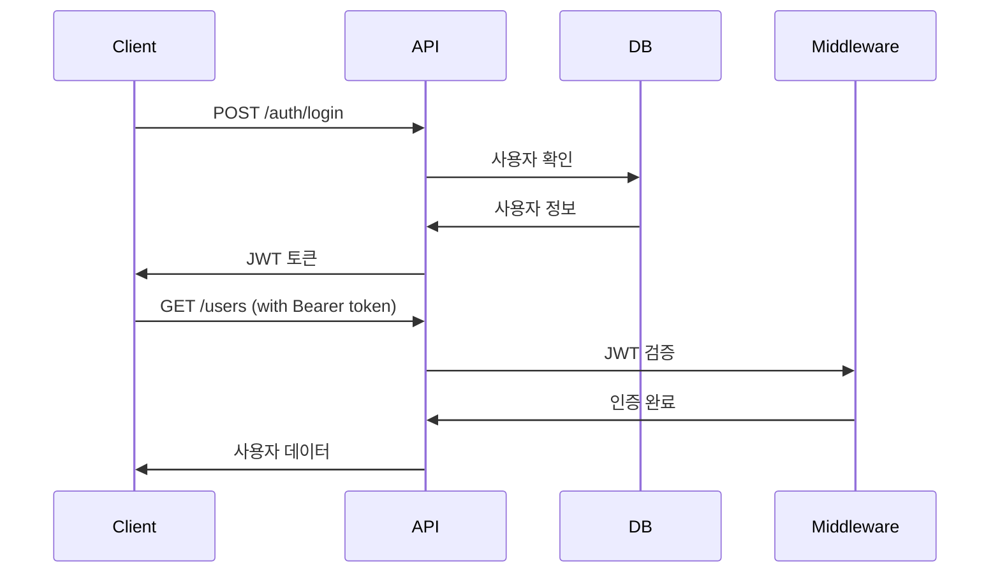

# Backend - Express.js API Server

사용자 관리 시스템의 백엔드 API 서버입니다.

## 🚀 빠른 시작

```bash
# 의존성 설치
npm install

# 환경 변수 설정
cp .env.example .env

# 개발 서버 실행
npm run dev
```

## 🛠️ 기술 스택

- **Runtime**: Node.js
- **Framework**: Express.js
- **Database**: MySQL
- **Authentication**: JWT
- **Password**: bcrypt
- **Security**: helmet, cors
- **Development**: nodemon

## 📁 프로젝트 구조

```
src/
├── app.js                   # 🎯 서버 진입점
├── routes/                  # 🛣️ API 라우트
│   ├── auth.js             # 인증/로그인
│   ├── users.js            # 사용자 관리
│   └── menu.js             # 메뉴 데이터
├── middleware/              # 🔒 미들웨어
│   ├── auth.js             # JWT 인증 미들웨어
│   └── validation.js       # 요청 검증
├── models/                  # 📊 데이터 모델
│   ├── User.js             # 사용자 모델
│   └── Menu.js             # 메뉴 모델
├── controllers/             # 🎮 컨트롤러
│   ├── authController.js   # 인증 컨트롤러
│   └── userController.js   # 사용자 컨트롤러
├── config/                  # ⚙️ 설정
│   ├── database.js         # DB 연결
│   └── jwt.js              # JWT 설정
└── utils/                   # 🛠️ 유틸리티
    ├── logger.js           # 로깅
    └── response.js         # 응답 포맷
```

## 🔗 API 엔드포인트

### 인증 (Auth)

```
POST   /api/auth/login     # 로그인
POST   /api/auth/register  # 회원가입
POST   /api/auth/refresh   # 토큰 갱신
DELETE /api/auth/logout    # 로그아웃
```

### 사용자 (Users)

```
GET    /api/users          # 사용자 목록 조회
GET    /api/users/:id      # 사용자 상세 조회
POST   /api/users          # 사용자 생성
PUT    /api/users/:id      # 사용자 수정
DELETE /api/users/:id      # 사용자 삭제
```

### 메뉴 (Menu)

```
GET    /api/menu           # 메뉴 목록 조회
GET    /api/menu/user/:id  # 사용자별 메뉴 권한
```

### 헬스체크

```
GET    /api/health         # 서버 상태 확인
```

## 🗃️ 데이터베이스 스키마

### Users 테이블

```sql
CREATE TABLE users (
  id INT PRIMARY KEY AUTO_INCREMENT,
  name VARCHAR(100) NOT NULL,
  email VARCHAR(255) UNIQUE NOT NULL,
  password VARCHAR(255) NOT NULL,
  role ENUM('admin', 'user') DEFAULT 'user',
  created_at TIMESTAMP DEFAULT CURRENT_TIMESTAMP,
  updated_at TIMESTAMP DEFAULT CURRENT_TIMESTAMP ON UPDATE CURRENT_TIMESTAMP
);
```

### Menu 테이블

```sql
CREATE TABLE menu (
  id INT PRIMARY KEY AUTO_INCREMENT,
  label VARCHAR(100) NOT NULL,
  path VARCHAR(255),
  parent_id INT,
  role_required ENUM('admin', 'user') DEFAULT 'user',
  sort_order INT DEFAULT 0,
  FOREIGN KEY (parent_id) REFERENCES menu(id)
);
```

## 🔧 환경 변수

```bash
# .env
NODE_ENV=development
PORT=3001

# Database
DB_HOST=localhost
DB_PORT=3306
DB_NAME=userpop_db
DB_USER=root
DB_PASSWORD=password

# JWT
JWT_SECRET=your-super-secret-key
JWT_EXPIRES_IN=24h
JWT_REFRESH_EXPIRES_IN=7d

# CORS
CORS_ORIGIN=http://localhost:5173
```

## 🔒 인증 플로우



## 🧪 테스트

```bash
# 단위 테스트
npm test

# 테스트 + 커버리지
npm run test:coverage

# API 테스트 (Thunder Client, Postman)
GET http://localhost:3001/api/health
```

## 🚀 배포

```bash
# 프로덕션 빌드
npm start

# PM2로 배포
npm install -g pm2
pm2 start src/app.js --name "userpop-api"
```

## 📦 주요 의존성

```json
{
  "express": "^4.18.2",
  "jsonwebtoken": "^9.0.2",
  "bcrypt": "^5.1.1",
  "mysql2": "^3.6.5",
  "helmet": "^7.1.0",
  "cors": "^2.8.5"
}
```
